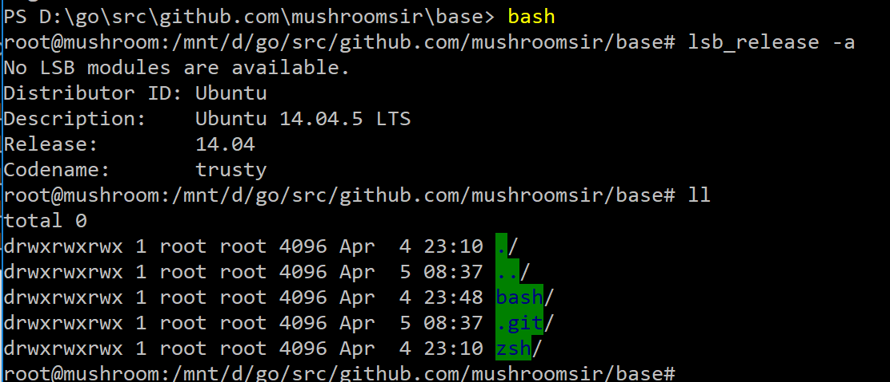
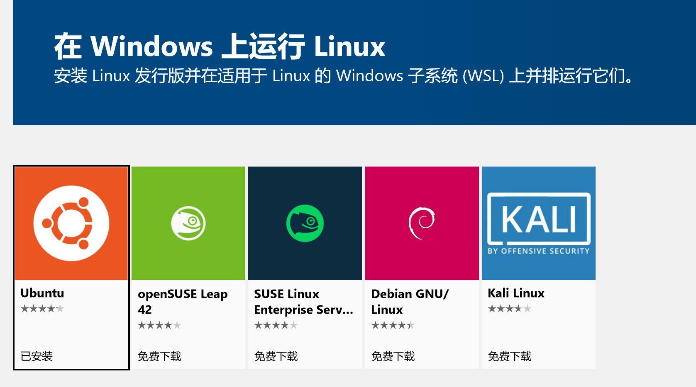

* [1\. WSL是什么](#1-wsl%E6%98%AF%E4%BB%80%E4%B9%88)
* [2\. WSL新特性](#2-wsl%E6%96%B0%E7%89%B9%E6%80%A7)
* [3\. WSL管理配置](#3-wsl%E7%AE%A1%E7%90%86%E9%85%8D%E7%BD%AE)
* [4\. WSL交互](#4-wsl%E4%BA%A4%E4%BA%92)
* [5\. 解决方案](#5-%E8%A7%A3%E5%86%B3%E6%96%B9%E6%A1%88)
  * [5\.1 使用别名](#51-%E4%BD%BF%E7%94%A8%E5%88%AB%E5%90%8D)
  * [5\.2 多复制一份](#52-%E5%A4%9A%E5%A4%8D%E5%88%B6%E4%B8%80%E4%BB%BD)
  * [5\.3 重定向](#53-%E9%87%8D%E5%AE%9A%E5%90%91)
  * [5\.4 symlink](#54-symlink)
* [6\. 其他](#6-%E5%85%B6%E4%BB%96)
  * [6\.1 闲聊](#61-%E9%97%B2%E8%81%8A)
  * [6\.2 参考](#62-%E5%8F%82%E8%80%83)
## 1. WSL是什么

​       WSL 是**Windows Subsystem for Linux** 的简称，主要是为了在Windows 10上原生运行Linux二进制可执行文件（ELF格式），而提供的兼容层。 通俗来讲是在Windows10 嵌入了个Linux子系统（默认是ubuntu），方便运行大部分 Linux 命令及软件，比如```grep``` ```MySQL``` ```Apache```。这很大方便了使用Windows做开发的同学，不需要双系统或虚拟机了。

   	在Windows功能中启用```适用于Linux的Windows子系统```，然后在Windows CMD中直接输入```bash```，即可进入Linux环境，执行命令：



## 2. WSL新特性

从Windows10 1709版本时开始，可以直接输入``wsl``进入交互环境， bash方式会逐渐废弃掉。

以前的 ```bash -c [command]```直接用 ```wsl [command]```来替代。

另一个特性是：Windows 10商店里，可以下载安装其他Linux发行版。这样就可以自由选择，不用限制到Ubuntu。


然后可以在程序列表中直接打开Ubuntu进入，或在CMD或Powershell中直接输入ubuntu进入：

```sh
PS D:\> ubuntu
mush@mushroom ~ % ls
go  mush  test
mush@mushroom ~ % pwd
/home/mush
mush@mushroom ~ %
```

后面都基于```wsl```，```Ubuntu```，```powershell```来介绍和演示。

## 3. WSL管理配置

Windows10自带了```wslconfig```，去管理多个安装的发行版，比如卸载某个发行版，设置默认启动的发型版。

在PowerShell中输入```wslconfig /?```， 可以看到:

```powershell
PS D:\> wslconfig /?
在 Linux Windows 子系统上执行管理操作

用法:
    /l, /list [/all] - 列出已注册的分发内容。
        /all - 有选择地列出所有分发内容，包括目前
               正安装或未安装的分发内容。
    /s, /setdefault <DistributionName> - 将指定的分发内容设置为默认值。
    /u, /unregister <DistributionName> - 注销分发内容。
```

切换默认发行版:

```powershell
PS D:\> wslconfig /l
# 适用于 Linux 的 Windows 子系统:
Legacy (默认)
Ubuntu
PS D:\> wslconfig /s Ubuntu
PS D:\> wslconfig /l
# 适用于 Linux 的 Windows 子系统:
Ubuntu (默认)
Legacy
```

在Windows 1803 后，还支持更多配置。比如网络，root目录等。进入发行版后， 可以在```/etc/wsl.conf```中配置。 如果没有该文件，可以手动创建一个配置:

```powershell
[automount]
enabled = true  # 自动挂载 c:/ 等到 /mnt
root = /windir/
options = "metadata,umask=22,fmask=11"
mountFsTab = false

[network]
generateHosts = true
generateResolvConf = true
```

## 4. WSL交互

 也是从1709开始，WSL支持在Windows 10上直接使用 Linux命令:

```CMD
PS D:\test>  wsl ls -la
total 5836
drwxrwxrwx 1 root root    4096 Jan 25 13:20 .
drwxrwxrwx 1 root root    4096 Apr 20 16:25 ..
-rwxrwxrwx 1 root root     105 Oct 14  2017 03-build.ps1
```

同样在 WSL 内也可以使用Windows应用程序，比如notepad，docker：

```CMD
root@mushroom:/mnt/d/go/src/code.teambition.com/soa/webhooks# docker.exe ps
CONTAINER ID        IMAGE                        COMMAND                  CREATED             STATUS              PORTS                                                                                        NAMES
63698edb01a8        quay.io/coreos/etcd:latest   "/usr/local/bin/etcd"    2 days ago          Up 27 hours         0.0.0.0:2379->2379/tcp, 2380/tcp                                                             etcd
```

这是个非常赞的特性，极大方便了开发者。但在使用过程中发现，有个体验非常不好的地方，必须带` .exe`后缀才行，不然会提示找不到命令 :

```sh
root@mushroom:/mnt/d/go/src/code.teambition.com/soa/webhooks# docker
The program 'docker' is currently not installed. You can install it by typing:
apt-get install docker
```

比如同事在mac上写了个```docker build```的脚本，放到Windows上后 想使用WSL去执行，发现必须加后缀才行，这样脚本就没办法统一了

## 5. 解决方案

当然也可以在中装个docker，而不是使用宿主机上的docker。但这样会很冗余，而且性能不好。经过一番折腾找到几种解决方案：

### 5.1 使用别名

在WSL 中.bashrc设置别名，去掉后缀:

```sh
alias docker=docker.exe
alias docker-compose=docker-compose.exe
```

这样就可以正确运行命令了， 但别名只在交互环境有效，脚本执行坏境不行。

### 5.2 多复制一份

在宿主机上找到 docker.exe，然后复制一份重命名为 docker 放到同级目录. 这样在wsl中也是可以执行的. 有点蠢萌黑魔法的感觉.

### 5.3 重定向

思路是定义```command_not_found_handle```函数(bash 4.0+ 支持)，当任何命令找不到时，都会调用调用它.  然后在该函数中尝试调用宿主机上cmd.exe，由它来来执行命令，并返回结果.

在.bashrc中添加:

```sh
command_not_found_handle() {
    if cmd.exe /c "(where $1 || (help $1 |findstr /V Try)) >nul 2>nul && ($* || exit 0)"; then
        return $?
    else
        if [ -x /usr/lib/command-not-found ]; then
           /usr/lib/command-not-found -- "$1"
           return $?
        elif [ -x /usr/share/command-not-found/command-not-found ]; then
           /usr/share/command-not-found/command-not-found -- "$1"
           return $?
        else
           printf "%s: command not found\n" "$1" >&2
           return 127
        fi
    fi
}
```

或在`.zshrc`中添加：

```sh
command_not_found_handler() {
    if cmd.exe /c "(where $1 || (help $1 |findstr /V Try)) >nul 2>nul && ($* || exit 0)"; then
        return $?
    else
        [[ -x /usr/lib/command-not-found ]] || return 1
        /usr/lib/command-not-found --no-failure-msg -- ${1+"$1"} && :
    fi
}
```

### 5.4 symlink

使用符号连接，讲宿主机上的docker.exe 映射到 WSL中：

```sh
ln -sf /mnt/c/Program\ Files/Docker/Docker/resources/bin/docker.exe /usr/bin/docker
```

## 6. 其他
### 6.1 闲聊

差不多有2年左右，没写博客了。主要是因为从C#/Net，转向Golang相关的技术栈了，需要重新积累和学习下。前期写了段时间c++，然后写Golang，发现Golang写着舒服多了。当然跟有了女朋友后，变懒也有很大关系。

这篇是开头，希望自己能继续坚持分享，也更有利于自己成长。新博客也会同步到github一份，方便记录修改。


### 6.2 参考

https://docs.microsoft.com/en-us/windows/wsl/interop

https://docs.microsoft.com/en-us/windows/wsl/wsl-config

https://github.com/Microsoft/WSL/issues/2003